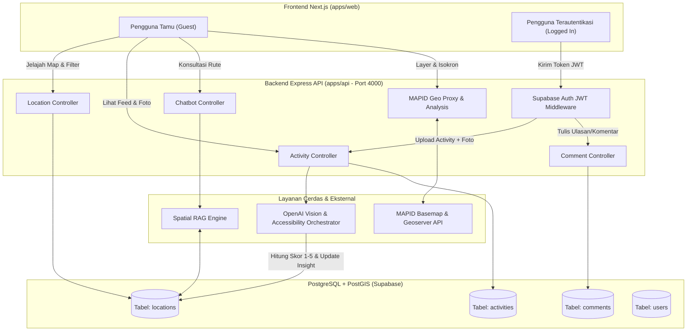

# Dokumentasi Resmi API & Arsitektur Backend - DifaMap WebGIS

Dokumentasi ini menjelaskan arsitektur backend, alur kerja data (*data flow*), spesifikasi endpoint REST API, parameter kueri, skema payload JSON, serta integrasi layanan **AI Orchestrator**, **Spatial RAG Chatbot**, dan **MAPID Geo Platform** (`apps/api`).

---

## 1. Arsitektur & Alur Kerja Sistem



---

## 2. Standar Autentikasi & Format Respon

* **Base URL**: `http://localhost:4000/api`
* **Header Autentikasi** (untuk endpoint yang membutuhkan login):
  ```http
  Authorization: Bearer <supabase_access_token>
  Content-Type: application/json
  ```

---

## 3. Dokumentasi Endpoint Lengkap

### A. Lokasi & Trotoar (`/api/locations`)

#### 1. Mengambil Daftar Lokasi & Filter Spasial
* **Method**: `GET`
* **URL**: `/api/locations`
* **Hak Akses**: Publik (Tamu & User Login)
* **Query Parameters**:
  * `entityType`: `PLACE` | `SIDEWALK` | `TRANSIT_HUB`
  * `category`: `MALL` | `RESTAURANT` | `TOURISM` | `HEALTHCARE` | `BUS_STOP` | dll
  * `wheelchairOnly`: `true` (Filter wajib memiliki ramp baik & permukaan rata)
  * `visuallyImpairedOnly`: `true` (Filter wajib memiliki guiding block tersambung)
  * `minScore`: `4.0` (Rating minimal 1.0 - 5.0)
  * `lighting`: `BRIGHT` | `DIM` | `DARK`
  * `crowd`: `QUIET` | `MODERATE` | `CROWDED`
  * `search`: string (Pencarian nama tempat atau ruas jalan)
  * `page`: integer (Default: `1`)
  * `limit`: integer (Default: `50`)

* **Contoh Respon (200 OK)**:
```json
{
  "success": true,
  "count": 1,
  "total": 1,
  "page": 1,
  "totalPages": 1,
  "data": [
    {
      "id": "7b8bb9c9-880d-11c7-bade-0a62ab123456",
      "name": "Mal Ratu Indah",
      "entityType": "PLACE",
      "category": "MALL",
      "specificLocation": "Jl. Dr. Sam Ratulangi No.35, Mamajang",
      "latitude": -5.15832,
      "longitude": 119.41654,
      "overallScore": 4.8,
      "physicalScore": 4.9,
      "safetyScore": 4.7,
      "rampStatus": "GOOD",
      "guidingBlockStatus": "GOOD",
      "sidewalkCondition": "NOT_APPLICABLE",
      "surfaceCondition": "SMOOTH",
      "seatingAvailability": "AVAILABLE",
      "toiletAccessibility": "AVAILABLE_GOOD",
      "lightingLevel": "BRIGHT",
      "crowdLevel": "MODERATE",
      "peakHours": "16:00 - 20:30",
      "safeVisitTime": "10:00 - 16:00",
      "aiSummary": "Fasilitas sangat ramah disabilitas dengan ramp standar, lift ber-braille, dan toilet disabilitas bersih.",
      "_count": {
        "activities": 12,
        "comments": 8
      }
    }
  ]
}
```

#### 2. Pencarian Lokasi Terdekat (PostGIS Proximity Search)
* **Method**: `GET`
* **URL**: `/api/locations/nearby?lat=-5.1476&lng=119.4063&radius=2500`
* **Hak Akses**: Publik
* **Fitur**: Menggunakan fungsi geospasial `ST_DWithin` dan `ST_Distance` PostGIS untuk mengembalikan daftar fasilitas terurut dari yang paling dekat (termasuk nilai `distanceMeters`).

#### 3. Mengambil Detail Satu Lokasi / Trotoar
* **Method**: `GET`
* **URL**: `/api/locations/:id`
* **Respon**: Mengembalikan seluruh data lokasi, 6 aktivitas terbaru, ulasan komentar, serta insight rekomendasi AI.


---

### B. Aktivitas Komunitas (`/api/activities`)

#### 1. Mengambil Feed Aktivitas
* **Method**: `GET`
* **URL**: `/api/activities`
* **Query Parameters**:
  * `locationId`: string (Filter aktivitas pada tempat tertentu)
  * `search`: string (Pencarian judul / lokasi)
  * `status`: `PUBLIC` | `DRAFT` (Default: `PUBLIC`)

#### 2. Membuat Postingan Aktivitas Baru (Wajib Login)
* **Method**: `POST`
* **URL**: `/api/activities`
* **Headers**: `Authorization: Bearer <token>`
* **Body Request**:
```json
{
  "title": "Mampir lihat Danau UNHAS",
  "description": "Jalur keliling danau cukup rata, terdapat ramp landai di dekat gazebo utama dan penerangan terang di malam hari.",
  "mediaUrls": [
    "https://tahxvguztbgijdemabiu.supabase.co/storage/v1/object/public/activities/danau1.jpg",
    "https://tahxvguztbgijdemabiu.supabase.co/storage/v1/object/public/activities/danau2.jpg"
  ],
  "specificLocation": "Danau UNHAS Tamalanrea",
  "latitude": -5.13842,
  "longitude": 119.49214,
  "status": "PUBLIC",
  "accessibilityTags": ["Kursi Roda", "Pemandangan", "Ramp Landai"]
}
```

* **Alur Logika AI**:
  1. AI secara otomatis menganalisis teks, foto, dan lokasi untuk menghitung `aiScore` (1.0 - 5.0).
  2. Jika `specificLocation` cocok dengan Tempat di database, AI **otomatis memperbarui rating dan deskripsi tempat tersebut**.
  3. Jika kosong, postingan hanya tersimpan sebagai feed komunitas tanpa mengubah rating tempat.

---

### C. Komentar & Ulasan (`/api/comments`)

* **Kirim Ulasan**: `POST /api/comments` (Wajib Login)
  ```json
  {
    "locationId": "7b8bb9c9-880d-11c7-bade-0a62ab123456",
    "content": "Petugas satpam sangat ramah membantu pengguna kursi roda saat masuk lobby barat."
  }
  ```
* **Lihat Komentar Tempat**: `GET /api/comments/location/:locationId`
* **Lihat Komentar Aktivitas**: `GET /api/comments/activity/:activityId`

---

### D. Chatbot Asisten Aksesibilitas (`/api/chatbot`)

#### Tanya Jawab Asisten Cerdas (Spatial RAG)
* **Method**: `POST`
* **URL**: `/api/chatbot/message`
* **Body Request**:
```json
{
  "message": "Apakah Pantai Losari ramah untuk pengguna kursi roda di sore hari?",
  "userLocation": {
    "latitude": -5.14766,
    "longitude": 119.40632
  }
}
```

* **Contoh Respon (200 OK)**:
```json
{
  "success": true,
  "data": {
    "reply": "Pantai Losari memiliki aksesibilitas yang sangat baik untuk pengguna kursi roda. Trotoar anjungan luas dan rata dengan ramp landai di pintu masuk utama. Waktu kunjungan paling nyaman adalah pukul 16:00 - 17:30 sebelum jam puncak keramaian.",
    "referencedLocations": [
      {
        "id": "losari-id",
        "name": "Anjungan Pantai Losari",
        "overallScore": 4.7,
        "rampStatus": "GOOD",
        "safeVisitTime": "06:00 - 18:00"
      }
    ]
  }
}
```

---

### E. MAPID Geo & Analisis Spasial (`/api/mapid`)

| Endpoint | Method | Fungsi & Parameter |
| :--- | :--- | :--- |
| `/api/mapid/styles/:styleId` | `GET` | Mengambil Style JSON MAPID Basemap (`basic`, `dark`, `light`, `street-2d-building`, `satellite`). |
| `/api/mapid/project/layers` | `GET` | Mengambil daftar layer aktif dari **MAPID Geoserver Open API**. |
| `/api/mapid/analysis/isochrone` | `GET` | **Isokron Catchment**: Menghitung poligon jangkauan 5, 10, 15 menit.<br>Query: `lat=-5.14&lng=119.45&intervals=5,10,15&mode=wheelchair` |
| `/api/mapid/analysis/elevation-slope` | `POST` | **Slope Profile**: Mengukur profil kelandaian tanjakan jalan dan mendeteksi rintangan $>8\%$. |
| `/api/mapid/analysis/sini-grid` | `GET` | **MAPID SINI AI Grid**: Menghitung heatmap prioritas intervensi infrastruktur multi-kriteria untuk seluruh wilayah Makassar. |
| `/api/mapid/layers/:layerId/geojson` | `GET` | Mengambil data GeoJSON mentah dari layer MAPID. |

---

## 4. Nilai-Nilai Enum Parameter

* **`EntityType`**: `PLACE`, `SIDEWALK`, `TRANSIT_HUB`
* **`RampStatus`**: `GOOD`, `DAMAGED`, `NONE`
* **`GuidingBlockStatus`**: `GOOD`, `DAMAGED`, `NONE`
* **`SidewalkCondition`**: `GOOD`, `NARROW`, `DAMAGED`, `BLOCKED`, `NOT_APPLICABLE`
* **`SurfaceCondition`**: `SMOOTH`, `SLIPPERY`, `POTHOLE`, `UNEVEN`
* **`SeatingAvailability`**: `AVAILABLE`, `NOT_AVAILABLE`
* **`ToiletAccessibility`**: `AVAILABLE_GOOD`, `AVAILABLE_DAMAGED`, `NOT_AVAILABLE`
* **`LightingLevel`**: `BRIGHT`, `DIM`, `DARK`
* **`CrowdLevel`**: `QUIET`, `MODERATE`, `CROWDED`
* **`WeeklyPattern`**: `WEEKDAY_BUSY`, `WEEKEND_BUSY`, `BALANCED`
* **`ActivityStatus`**: `DRAFT`, `PUBLIC`, `ARCHIVED`
