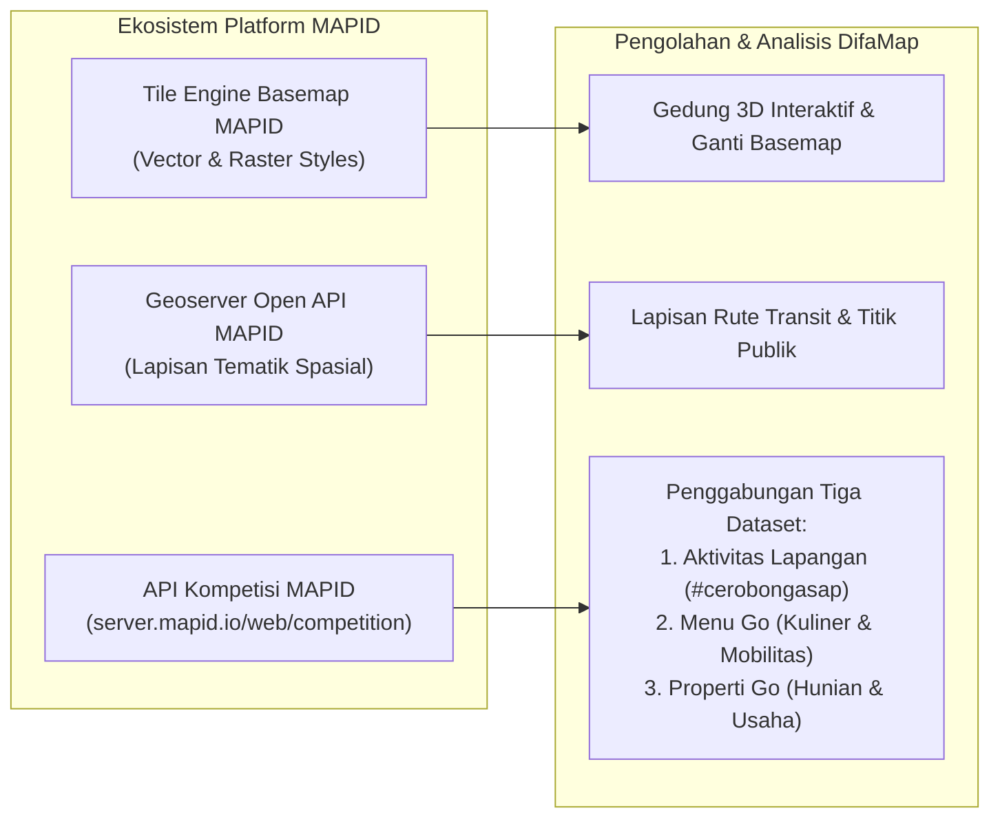
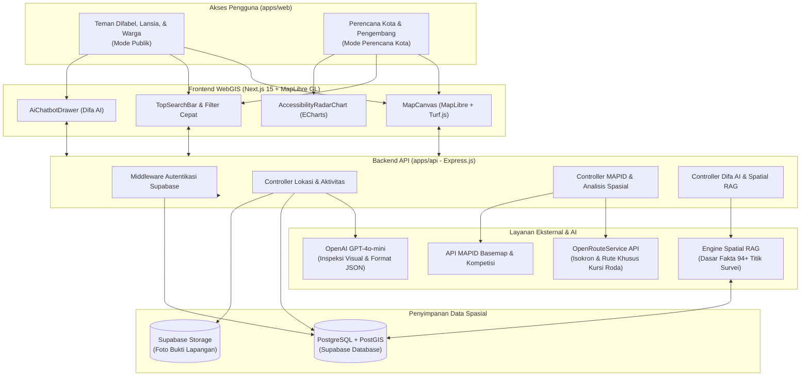

<div align="center">

# 🗺️ DifaMap WebGIS
### *Peta Aksesibilitas Fasilitas Publik & Pedestrian Ramah Difabel dan Lansia*
**Karya Inovasi WebGIS untuk MAPID Competition 2026**

[](https://mapid.io)
[](https://nextjs.org/)
[](https://expressjs.com/)
[](https://maplibre.org/)
[](https://postgis.net/)
[](https://openai.com/)
[](https://turbo.build/)

<br/>

> **"Aksesibilitas bukan sekadar fasilitas tambahan, melainkan hak mendasar agar setiap warga kota bisa bepergian dengan mandiri, aman, dan nyaman."**

<br/>

**Oleh: Tim Cerobong Asap**  
*Fokus Wilayah: Koridor Transportasi & Pusat Aktivitas Kota Makassar dan Kabupaten Gowa.*

---

</div>

## 📑 Daftar Isi
1. [Kenapa DifaMap Dibuat?](#-kenapa-difamap-dibuat)
2. [Prinsip Kejujuran & Transparansi Data](#-prinsip-kejujuran--transparansi-data)
3. [Integrasi dengan Platform MAPID](#-integrasi-dengan-platform-mapid)
4. [Arsitektur Sistem & Alur Data](#-arsitektur-sistem--alur-data)
5. [Fitur Unggulan DifaMap](#-fitur-unggulan-difamap)
   - [Mode Publik (Untuk Teman Difabel, Lansia, & Warga)](#1-mode-publik-untuk-teman-difabel-lansia--warga)
   - [Mode Perencana Kota (Spatial Decision Support System)](#2-mode-perencana-kota-spatial-decision-support-system)
   - [Difa AI Assistant (Spatial RAG)](#3-difa-ai-assistant-spatial-rag)
   - [Inspeksi Otomatis AI (Multimodal Vision)](#4-inspeksi-otomatis-ai-multimodal-vision)
6. [Teknologi yang Digunakan (Tech Stack)](#-teknologi-yang-digunakan-tech-stack)
7. [Struktur Folder Proyek](#-struktur-folder-proyek)
8. [Cara Menjalankan di Komputer Lokal](#-cara-menjalankan-di-komputer-lokal)
9. [Variabel Lingkungan (.env)](#-variabel-lingkungan-env)
10. [Dokumentasi Lengkap](#-dokumentasi-lengkap)
11. [Tim Pengembang](#-tim-pengembang-cerobong-asap)

---

## 🌍 Kenapa DifaMap Dibuat?

Bagi sebagian besar orang, berjalan kaki menuju halte bus atau menyeberang ke minimarket adalah hal yang lumrah. Namun bagi **pengguna kursi roda, tunanetra, dan lansia**, perjalanan singkat bisa berubah menjadi rute yang penuh risiko. 

Di kawasan perkotaan seperti **Kota Makassar dan sekitarnya (termasuk Kabupaten Gowa)**, perkembangan kota belum selalu diimbangi oleh fasilitas trotoar yang ramah:

1. **Aplikasi Peta Biasa Punya Titik Buta (*Blind Spot*)**: Google Maps atau aplikasi navigasi umum hanya menghitung rute tercepat untuk kendaraan atau pejalan kaki tanpa hambatan. Peta-peta tersebut tidak tahu apakah trotoar punya ramp landai, apakah ubin pemandu (*guiding block*) terputus ke selokan, atau apakah jalur pejalan kaki terhalang tiang listrik dan gerobak PKL.
2. **Konektivitas Halte yang Terputus (*First-Mile / Last-Mile Gap*)**: Sering kali seseorang bisa menaiki bus transit, tetapi kesulitan begitu turun di halte karena tidak ada jalan landai untuk menyeberang menuju gedung tujuan (rumah sakit, sekolah, kantor pelayanan, atau pusat perbelanjaan).
3. **Perbaikan Kota yang Belum Tepat Sasaran**: Anggaran perbaikan trotoar sering dialokasikan tanpa data spasial yang jelas mengenai titik mana yang paling mendesak dan memberi dampak nyata bagi mobilitas warga difabel.

### Solusi DifaMap
**DifaMap** adalah WebGIS inklusif yang menggabungkan **survei lapangan langsung**, data geospasial resmi dari **MAPID**, analisis rute jaringan jalan nyata (*wheelchair network routing*), dan kecerdasan buatan (**Multimodal AI & Spatial RAG**). DifaMap hadir untuk membantu mobilitas harian warga sekaligus menjadi alat bantu pengambilan keputusan bagi perencana kota.

---

## 🔍 Prinsip Kejujuran & Transparansi Data

DifaMap memegang teguh prinsip **kejujuran dan transparansi data spasial**:

* **"Belum Teramati" $\neq$ "Aman"**: Jika foto survei tidak memperlihatkan ramp atau lampu penerangan jalan, sistem menilainya sebagai `NOT_VISIBLE` (belum teramati), bukan langsung menganggapnya ada atau mengarang bebas.
* **Wilayah Tanpa Data Dibiarkan Kosong**: Petak wilayah yang belum memiliki titik survei dibiarkan **kosong tanpa warna** pada peta analisis, bukan diisi skor tebakan. Kekosongan data disajikan secara jujur apa adanya.
* **Tingkat Keyakinan AI (*Confidence Score*)**: Setiap ulasan AI dilengkapi skor keyakinan (0.0 – 1.0) yang diukur dari kejelasan dan kelengkapan bukti visual foto survei.
* **Jaringan Jalan Nyata vs Lingkaran Radius Teoretis**: Perhitungan jangkauan kursi roda dihitung berdasarkan jaringan jalan sesungguhnya lewat **OpenRouteService (Wheelchair Profile)** dengan uji poligon spasial (*point-in-polygon*), bukan sekadar lingkaran jarak lurus yang menembus bangunan atau menyeberang sungai tanpa jembatan.

---

## 🛰️ Integrasi dengan Platform MAPID

DifaMap terhubung erat dengan ekosistem **MAPID Platform** di berbagai fungsi utama:



1. **MAPID Basemap Tile & Style Engine**:
   - Pilihan 5 gaya basemap: `basic` (dengan visualisasi gedung 3D interaktif), `light`, `dark`, `street-2d-building`, dan `satellite`.
   - Caching gaya basemap di server backend untuk performa cepat dan navigasi yang mulus.
2. **MAPID Geoserver Open API**:
   - Mengambil data lapisan tematik publik: koridor transportasi massal Mamminasata, fasilitas kesehatan, dan jaringan pejalan kaki.
3. **MAPID Competition API (`/web/competition`)**:
   - **Community Maps (Activities)**: Data survei primer aksesibilitas fisik yang dikumpulkan langsung oleh tim surveyor (`#cerobongasap`) di 7 wilayah Kota Makassar dan Kabupaten Gowa.
   - **Menu Go**: Peta kuliner dan tempat makan lokal lengkap dengan informasi kondisi tempat dan mobilitas fisik.
   - **Properti Go**: Pemetaan properti perumahan dan komersial untuk menilai potensi kawasan ramah disabilitas.

---

## 🏗️ Arsitektur Sistem & Alur Data

DifaMap dibangun dengan struktur monorepo modern yang rapi dan modular:



---

## ✨ Fitur Unggulan DifaMap

DifaMap menyediakan dua mode tampilan yang dapat diakses langsung di satu peta:

### 1. Mode Publik (Untuk Teman Difabel, Lansia, & Warga)
* **Peta Aksesibilitas Berkode Warna**:
  Titik fasilitas publik, halte, dan trotoar diberi tanda warna yang mudah dikenali:
  * 🟢 **Hijau (Skor $\ge 3.5$)**: Sangat ramah disabilitas (*ramp* landai, ubin pemandu rapi, trotoar rata).
  * 🟡 **Jingga (Skor $2.5 - 3.5$)**: Cukup layak dengan catatan (misal: *ramp* agak curam, paving sedikit bergelombang).
  * 🔴 **Merah (Skor $< 2.5$)**: Berbahaya / tidak ramah (tanpa *ramp*, ubin pemandu terputus, trotoar berlubang).
  * ⚪ **Abu-abu**: Titik baru terdata yang belum dinilai AI.
* **Penyaring Cepat Kebutuhan Aksesibilitas**:
  Temukan titik yang cocok dengan satu ketukan:
  * Pengguna Kursi Roda (wajib ada ramp layak, permukaan mulus).
  * Teman Tunanetra (wajib ada ubin pemandu tersambung).
  * Kategori Lokasi (Mall, Rumah Sakit, Kampus/Sekolah, Halte Bus, Restoran).
  * Fasilitas Pendukung (Penerangan terang malam hari, toilet disabilitas, bangku istirahat).
* **Pencarian Cerdas & Tunjuk Lokasi**:
  Cari tempat lewat kolom pencarian atau pilih titik koordinat langsung dari peta dengan fitur interaktif.
* **Panel Detail Lengkap**:
  * Galeri foto asli dari hasil survei lapangan.
  * Grafik Radar multi-faktor kondisi fisik vs keamanan lingkungan.
  * Rekomendasi jam kunjungan paling aman & nyaman (*safe visit time*).
  * Rangkuman catatan surveyor dan saran perbaikan dari AI.
* **Layanan Laporan Warga ("Bagikan Laporan")**:
  Warga dapat berkontribusi melaporkan fasilitas publik yang rusak atau ramah difabel dengan mengunggah foto dan lokasi GPS langsung ke sistem.

---

### 2. Mode Perencana Kota (Spatial Decision Support System)
Dirancang untuk dinas teknis (PU, Perhubungan), instansi pemerintah, dan pengembang tata ruang:

* **Site Selection (SINI Grid Multi-Kriteria)**:
  * Membagi peta wilayah studi menjadi sel grid spasial (1.000 m atau 500 m).
  * Menghitung **Skor Prioritas Perbaikan** berdasarkan 3 sudut pandang:
    1. **Aksesibilitas & Keramaian**: Memprioritaskan petak yang ramai pejalan kaki namun kondisi trotoarnya buruk.
    2. **Hunian & Akses Transit**: Menemukan pemukiman warga yang sulit menjangkau transportasi massal inklusif.
    3. **Komersial & Fasilitas Difabel**: Menemukan pusat usaha yang ramai namun fasilitas difabelnya masih minim.
  * Menyajikan rekomendasi perbaikan berbasis data nyata yang dapat langsung dieksekusi.
* **Site Analysis (Analisis Jangkauan Waktu Tempuh Kursi Roda)**:
  * Menghitung area yang benar-benar bisa dijangkau pengguna kursi roda dalam waktu **5, 10, dan 15 menit**.
  * Mendeteksi fasilitas yang terjangkau serta fasilitas penting yang berada di luar jangkauan aman.
  * Menampilkan persentase kelengkapan data survei di dalam area analisis.
* **Simulasi & Komparasi Dua Lokasi**:
  * Membandingkan dua calon lokasi halte atau fasilitas publik secara berdampingan untuk menentukan pilihan terbaik.
* **Eksplorasi Data MAPID Menu Go & Properti Go**:
  * Memetakan sebaran kuliner, kafe, dan kawasan properti untuk melihat potensi pengembangan kawasan ramah difabel.
* **Desain Responsif Mobile**:
  * Panel perencana dapat ditarik (*drag*) atas-bawah dengan mulus di layar smartphone (*peek* untuk melihat peta dan *expanded* untuk melihat data lengkap).

---

### 3. Difa AI Assistant (Spatial RAG)
Bukan sekadar chatbot teks biasa, **Difa AI** membaca data survei lapangan dan koordinat PostGIS secara langsung:

* **Konsultasi Rute Ramah Kursi Roda**: Difa AI merekomendasikan rute yang memilih trotoar landai dan menghindari tanjakan curam ($>8\%$), lalu **menggambar jalurnya langsung di atas peta**.
* **Spatial RAG Tanpa Halusinasi**: Jawaban AI didasarkan pada fakta dari 94+ titik survei lapangan dan kalkulasi spasial PostGIS (`ST_DWithin`), bukan tebakan acak.
* **Panduan Perjalanan**: Memberikan informasi waktu terbaik untuk berkunjung dan titik-titik yang perlu diwaspadai di sepanjang jalan.

---

### 4. Inspeksi Otomatis AI (Multimodal Vision)
* Memanfaatkan **OpenAI GPT-4o-mini Vision** dengan format keluaran terstruktur (*Structured Output*).
* Menilai foto laporan secara otomatis untuk memeriksa kelayakan ramp, kondisi ubin pemandu, kelebaran jalan, lubang, dan penerangan.
* Memberikan nilai bintang gabungan (1.0 – 5.0) dan skor keyakinan secara konsisten dan objektif.

---

## 💻 Teknologi yang Digunakan (Tech Stack)

| Bagian | Teknologi | Fungsi & Peran |
| :--- | :--- | :--- |
| **Pengelolaan Monorepo** | Turborepo, npm Workspaces | Manajemen monorepo frontend, backend, dan package bersama |
| **Frontend Framework** | **Next.js 15 (App Router)**, React 19, TypeScript | Tampilan responsif, cepat, dan modern |
| **Peta & Visualisasi Spasial** | **MapLibre GL JS (v5)**, Turf.js | Render basemap MAPID, visualisasi gedung 3D, poligon jangkauan, dan layer spasial |
| **Grafik & Data** | **Apache ECharts**, echarts-for-react | Visualisasi Radar Chart multi-faktor aksesibilitas |
| **Desain & Ikon** | Vanilla CSS, Lucide React | Tampilan bersih, ringan, dan ramah pengguna |
| **Backend API Server** | **Express.js (v4, ESM)**, Node.js, TypeScript | REST API, validasi skema Zod, dan pengolahan data spasial |
| **ORM & Database** | **Prisma ORM (v6)**, PostgreSQL, **PostGIS** | Manajemen database relasional dan fungsi kueri spasial |
| **Penyimpanan Cloud & Auth** | **Supabase** | Layanan PostgreSQL cloud, PostGIS, dan Supabase Storage foto laporan |
| **Platform Geospasial Mitra** | **MAPID Platform** | Basemap Tile Service, Geoserver API, dan API Kompetisi MAPID |
| **Rute & Jaringan Jalan** | **OpenRouteService API** | Kalkulasi rute jalan dan isokron khusus kursi roda (*wheelchair*) |
| **Kecerdasan Buatan (AI)** | **OpenAI GPT-4o-mini** | Inspeksi foto survei otomatis dan chatbot spasial Difa AI |

---

## 📁 Struktur Folder Proyek

```text
DifaMap/
├── apps/
│   ├── api/                          # Backend Express.js REST API
│   │   ├── prisma/
│   │   │   ├── schema.prisma         # Skema database relasional & spasial PostGIS
│   │   │   └── seed.ts               # Data awal untuk pengujian
│   │   ├── src/
│   │   │   ├── config/               # Konfigurasi & validasi variabel lingkungan (Zod)
│   │   │   ├── controllers/          # Logika pemroses endpoint API
│   │   │   ├── middlewares/          # Autentikasi JWT Supabase & penanganan error
│   │   │   ├── routes/               # Jalur rute REST API
│   │   │   └── services/             # Layanan bisnis:
│   │   │       ├── aiOrchestrator.service.ts   # Inspeksi foto via OpenAI Vision
│   │   │       ├── chatbotContext.ts           # Konteks data untuk Spatial RAG
│   │   │       ├── mapid.service.ts            # Integrasi Basemap & Grid SINI MAPID
│   │   │       ├── mapidCompetition.service.ts # Klien API Kompetisi MAPID
│   │   │       ├── rute.service.ts             # Kalkulasi rute kursi roda ORS
│   │   │       └── siteInsight.service.ts      # Analisis isokron & perbandingan lokasi
│   │   └── package.json
│   │
│   └── web/                          # Frontend Next.js 15 WebGIS
│       ├── public/                   # Asset gambar, ikon, dan logo
│       ├── src/
│       │   ├── app/                  # Halaman Next.js App Router & layout
│       │   ├── components/
│       │   │   ├── chatbot/          # Panel Difa AI & komponen teks kaya
│       │   │   ├── charts/           # Komponen Radar Chart ECharts
│       │   │   ├── common/           # Badge, status, dan animasi loading
│       │   │   ├── drawer/           # Panel informasi detail lokasi & survei
│       │   │   ├── layout/           # Sidebar pilihan mode & bilah pencarian atas
│       │   │   ├── map/              # Komponen kanvas peta MapLibre & gedung 3D
│       │   │   └── modals/           # Modal laporan baru, info panduan, & lightbox foto
│       │   ├── context/              # Manajemen state aplikasi
│       │   ├── data/                 # Data referensi & filter
│       │   ├── hooks/                # Custom React Hooks (deteksi mobile, dll.)
│       │   └── lib/                  # Klien API fetcher & utilitas pembantu
│       └── package.json
│
├── packages/
│   └── tsconfig/                     # Konfigurasi bersama TypeScript
├── AGENTS.md                         # Pedoman teknis pengembangan monorepo & Prisma
├── API_DOCUMENTATION.md              # Dokumentasi lengkap REST API & contoh JSON
├── erd.md                            # Skema relasi database (ERD) & penjelasan tabel
├── SERAH-TERIMA-DEPLOY.md            # Catatan serah terima & checklist hosting produksi
├── package.json                      # Konfigurasi root monorepo
├── turbo.json                        # Konfigurasi pipeline Turborepo
└── README.md                         # Dokumentasi utama proyek DifaMap
```

---

## 🚀 Cara Menjalankan di Komputer Lokal

### 1. Prasyarat
* **Node.js**: Versi `>=20.0.0` (disarankan Node 22 LTS).
* **npm**: Versi `>=10.0.0`.
* Proyek aktif di **Supabase** (dengan ekstensi PostGIS aktif).
* Kunci API aktif dari **OpenAI**, **MAPID Platform**, dan **OpenRouteService**.

### 2. Unduh Repositori
```bash
git clone https://github.com/Cerobong-Asap-Mapid-WebGis-Competition/DifaMap.git
cd DifaMap
```

### 3. Pasang Dependensi
Pasang seluruh dependensi monorepo dari folder root:
```bash
npm install
```

### 4. Konfigurasi File Lingkungan (.env)
Salin contoh file `.env.example` ke `.env` pada folder backend dan frontend:

```bash
# Konfigurasi backend
cp apps/api/.env.example apps/api/.env

# Konfigurasi frontend
cp apps/web/.env.example apps/web/.env
```

### 5. Siapkan Database Prisma
Jalankan sinkronisasi skema ke database Supabase:
```bash
cd apps/api
npm run db:generate
npm run db:push
```

### 6. Jalankan Aplikasi
Jalankan backend dan frontend secara bersamaan dari folder root DifaMap:
```bash
npm run dev
```

* **Frontend WebGIS**: buka di browser `http://localhost:3000`
* **Backend API**: berjalan di `http://localhost:4000`
* **Cek Status API**: `http://localhost:4000/api/health`

---

## 📚 Dokumentasi Lengkap

Untuk panduan teknis lebih mendalam, silakan buka dokumen berikut:
* **[API_DOCUMENTATION.md](./API_DOCUMENTATION.md)**: Spesifikasi endpoint REST API, parameter kueri spasial, format body request, dan contoh respons JSON.
* **[erd.md](./erd.md)**: Skema relasi database (ERD), tabel Prisma, indeks spasial PostGIS, dan tipe enum parameter.
* **[AGENTS.md](./AGENTS.md)**: Panduan standar pengembangan monorepo, sinkronisasi tipe Prisma, dan validasi kode.
* **[SERAH-TERIMA-DEPLOY.md](./SERAH-TERIMA-DEPLOY.md)**: Panduan konfigurasi hosting produksi, bucket Supabase Storage, dan mitigasi pembatasan rate-limit.

---

## 👥 Tim Pengembang (Cerobong Asap)

DifaMap dikembangkan untuk **MAPID Competition 2026** oleh **Tim Cerobong Asap**:

* **Surveyor Lapangan & Kontributor Data Spasial**:
  * `randymuflih` (Randy Muflih)
  * `atyas` (Atyas)
  * `amarr` (Amar)
  * `aixii16` (Aixii)
* **Tagar Survei Lapangan**: `#cerobongasap`
* **Wilayah Studi Lapangan**: 7 Zona Koridor & Pusat Kawasan di Kota Makassar dan Kabupaten Gowa (*Tamalate, Tamalanrea, Mariso, Ujung Pandang, Rappocini, Somba Opu, Bontomarannu*).

---

<div align="center">

**DifaMap WebGIS &copy; 2026 Tim Cerobong Asap &bull; Dikembangkan untuk MAPID Competition 2026**  
*Mewujudkan Perkotaan yang Inklusif, Aksesibel, dan Nyaman bagi Semua.*

</div>
