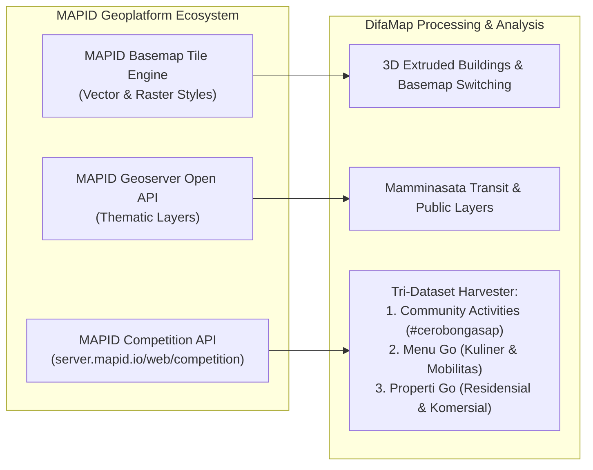
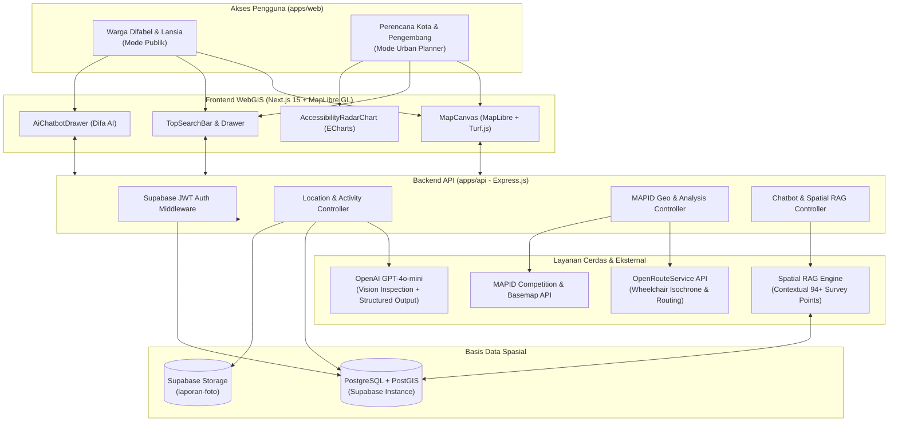

<div align="center">

# 🗺️ DifaMap WebGIS
### *Peta Aksesibilitas Fasilitas Publik & Pedestrian Inklusif Ramah Difabel dan Lansia*
**Karya Inovasi WebGIS untuk MAPID Competition 2026**

[](https://mapid.io)
[](https://nextjs.org/)
[](https://expressjs.com/)
[](https://maplibre.org/)
[](https://postgis.net/)
[](https://openai.com/)
[](https://turbo.build/)

<br/>

> **"Aksesibilitas bukanlah fasilitas pelengkap, melainkan hak asasi bagi setiap warga kota untuk bergerak secara mandiri, aman, dan bermartabat."**

<br/>

**Oleh: Tim Cerobong Asap**  
*Wilayah Studi: Koridor Transportasi & Pusat Kegiatan Kota Makassar & Kabupaten Gowa.*

---

</div>

## 📑 Daftar Isi
1. [Latar Belakang & Urgensi Masalah](#-latar-belakang--urgensi-masalah)
2. [Prinsip Integritas & Kejujuran Data](#-prinsip-integritas--kejujuran-data)
3. [Integrasi Ekosistem MAPID Platform](#-integrasi-ekosistem-mapid-platform)
4. [Arsitektur Sistem & Alur Data](#-arsitektur-sistem--alur-data)
5. [Fitur-Fitur Utama DifaMap](#-fitur-fitur-utama-difamap)
   - [Mode Publik (Ramah Difabel & Lansia)](#1-mode-publik-ramah-difabel-lansia--warga)
   - [Mode Perencana Kota (Spatial Decision Support System)](#2-mode-perencana-kota-spatial-decision-support-system)
   - [Difa AI Conversational Assistant (Spatial RAG)](#3-difa-ai-conversational-assistant-spatial-rag)
   - [AI Multimodal Spatial & Accessibility Inspector](#4-ai-multimodal-spatial--accessibility-inspector)
6. [Teknologi yang Digunakan (Tech Stack)](#-teknologi-yang-digunakan-tech-stack)
7. [Struktur Direktori Monorepo](#-struktur-direktori-monorepo)
8. [Panduan Instalasi & Menjalankan Lokal](#-panduan-instalasi--menjalankan-lokal)
9. [Variabel Lingkungan (Environment Variables)](#-variabel-lingkungan-environment-variables)
10. [Dokumentasi Terkait](#-dokumentasi-terkait)
11. [Tim Pengembang](#-tim-pengembang-cerobong-asap)

---

## 🌍 Latar Belakang & Urgensi Masalah

Mobilitas mandiri di kawasan perkotaan Indonesia masih menjadi tantangan berat bagi jutaan **penyandang disabilitas (pengguna kursi roda, tunanetra, disabilitas sensorik)**, **lansia**, dan **kelompok rentan** lainnya. Di kota metropolitan seperti **Kota Makassar dan kawasan aglomerasi Mamminasata (termasuk Kabupaten Gowa)**, perkembangan ekonomi dan simpul transit publik yang pesat sering kali belum diimbangi oleh infrastruktur pejalan kaki (*pedestrian infrastructure*) yang ramah disabilitas:

1. **Titik Buta (*Blind Spot*) Peta Konvensional**: Aplikasi navigasi komersial populer (seperti Google Maps) dirancang terutama untuk kendaraan bermotor atau pejalan kaki tanpa hambatan fisik. Peta-peta tersebut tidak mencatat rincian mikro-spasial: apakah sebuah trotoar memiliki ramp yang landai ($\le 8\%$), apakah ubin pemandu (*guiding block*) terputus ke selokan terbuka, atau apakah trotoar terblokir oleh tiang listrik dan PKL.
2. **Ketiadaan Rantai Perjalanan yang Tersambung (*First-Mile / Last-Mile Transit Gap*)**: Pengguna kursi roda sering kali bisa menaiki bus transit, tetapi terjebak begitu turun di halte karena tidak adanya ramp penyeberangan atau tingginya trap trotoar untuk menuju gedung tujuan (mall, rumah sakit, kantor layanan publik).
3. **Ketimpangan Perencanaan Kota (*Urban Planning Gap*)**: Pemerintah daerah, dinas teknis, maupun pengembang swasta kerap mengalokasikan anggaran perbaikan trotoar secara sporadis tanpa basis data spasial multi-kriteria yang menunjukkan titik mana yang paling berdampak besar bagi mobilitas warga rentan.

### Solusi: DifaMap WebGIS
**DifaMap** hadir sebagai platform **Sistem Informasi Geografis Berbasis Web (WebGIS)** yang memadukan **survei lapangan spasial partisipatif**, integrasi data ekosistem **MAPID**, algoritma analisis jaringan jalan sesungguhnya (*network isochrone*), serta kecerdasan buatan (**Multimodal AI & Spatial RAG**) untuk menjembatani kebutuhan navigasi warga difabel sekaligus menyediakan *Spatial Decision Support System (SDSS)* bagi para perencana kota.

---

## 🔍 Prinsip Integritas & Kejujuran Data

DifaMap dibangun dengan **etika data spasial dan kecerdasan buatan yang transparan (*Data Honesty Principle*)**:

* **"Belum Teramati" $\neq$ "Tidak Ada"**: Jika foto survei lapangan tidak menangkap lampu penerangan malam atau toilet disabilitas di dalam gedung, AI dan sistem menandainya sebagai `NOT_VISIBLE` (belum teramati), bukan berasumsi buruk atau mengada-ada.
* **Tidak Ada Halusinasi Wilayah Kosong**: Petak wilayah yang belum pernah disurvei dibiarkan **kosong tanpa warna** pada peta intervensi, bukan diberi skor rata-rata tebakan (3.0). Kekosongan data dilaporkan secara jujur apa adanya.
* **Skor Keyakinan Transparan (*AI Confidence Score*)**: Setiap penilaian AI disertai indikator keyakinan (0.0 – 1.0) yang bergantung pada kelengkapan bukti visual foto survei.
* **Isokron Jaringan Jalan Nyata vs Lingkaran Radius**: Perhitungan jangkauan waktu tempuh kursi roda menggunakan jaringan jalan riil dari **OpenRouteService (Wheelchair Profile)** dengan uji *point-in-polygon*, bukan sekadar lingkaran Euclidean teoretis yang menembus tembok atau menyeberangi sungai tanpa jembatan.

---

## 🛰️ Integrasi Ekosistem MAPID Platform

Sebagai proyek yang dirancang khusus untuk ajang **MAPID Competition 2026**, DifaMap memaksimalkan kapabilitas platform geospasial **MAPID** pada seluruh lapisan arsitekturnya:



1. **MAPID Basemap Tile & Style Engine**:
   - Integrasi 5 opsi gaya peta: `basic` (dilengkapi lapisan *3D extruded buildings* / bangunan tiga dimensi interaktif), `light`, `dark`, `street-2d-building`, dan `satellite`.
   - Caching gaya basemap di memori backend untuk meminimalkan beban koneksi dan menjamin ketersediaan tinggi (*seamless fallback*).
2. **MAPID Geoserver Open API**:
   - Konsumsi lapisan tematik geospasial proyek MAPID: Jaringan Transportasi Massal Mamminasata, Fasilitas Kesehatan & Disabilitas, serta Jalur Pedestrian.
3. **MAPID Competition API (`/web/competition`)**:
   - **Community Maps (Activities)**: Data primer survei lapangan aksesibilitas fisik yang dikirimkan oleh surveyor tim (`#cerobongasap`) di 7 zona Kota Makassar & Kabupaten Gowa.
   - **Menu Go**: Analisis kepadatan kuliner dan UMKM lokal lengkap dengan atribut kondisi tempat dan mobilitas fisik.
   - **Properti Go**: Pemetaan properti komersial dan residensial untuk mengukur kepadatan aktivitas ekonomi dan potensi investasi kawasan inklusif.

---

## 🏗️ Arsitektur Sistem & Alur Data

DifaMap mengadopsi arsitektur monorepo modern dengan pemisahan tanggung jawab yang modular:



---

## ✨ Fitur-Fitur Utama DifaMap

DifaMap menyediakan dua antarmuka pengalaman pengguna (*Dual-Persona Interface*) yang terintegrasi di dalam satu kanvas peta geospasial:

### 1. Mode Publik (Ramah Difabel, Lansia, & Warga)
* **Peta Aksesibilitas Tematik Interaktif**:
  Visualisasi titik fasilitas publik, trotoar, dan halte dengan pin berkode warna standar yang jelas:
  * 🟢 **Hijau (Skor $\ge 3.5$)**: Fasilitas sangat ramah disabilitas (*ramp* landai, *guiding block* rapi, trotoar rata).
  * 🟡 **Jingga (Skor $2.5 - 3.5$)**: Cukup aksesibel dengan catatan (misal: *ramp* agak curam, paving sedikit bergelombang).
  * 🔴 **Merah (Skor $< 2.5$)**: Tidak ramah / berbahaya (ubin pemandu terputus, tangga tanpa *ramp*, trotoar terblokir).
  * ⚪ **Abu-abu**: Titik baru terdata yang belum dievaluasi oleh AI.
* **Penyaring Cerdas Fasilitas Disabilitas**:
  Menyaring peta seketika berdasarkan kebutuhan spesifik:
  * Khusus Pengguna Kursi Roda (*ramp* wajib ada/layak, permukaan halus tanpa lubang).
  * Khusus Penyandang Tunanetra (*guiding block* terpasang baik dan tersambung).
  * Kategori Tempat (Mall, Rumah Sakit, Kampus/Sekolah, Halte Transit, Restoran).
  * Filter Keamanan & Kenyamanan (Penerangan terang malam hari, toilet disabilitas, tempat istirahat/duduk).
* **Pencarian Cerdas & POI Geocoding**:
  Mencari lokasi dari data survei lokal maupun tempat di luar basis data menggunakan data POI Basemap MAPID, disertai fitur **"Tunjuk Lokasi di Peta"** (*interactive coordinate picker*).
* **Drawer Detail Aksesibilitas Mendalam**:
  * Galeri foto resolusi tinggi dari surveyor lapangan.
  * **Grafik Radar Multi-Dimensi (ECharts)**: Skor fisik vs skor keamanan.
  * Jam sibuk (*peak hours*) dan rekomendasi waktu kunjungan paling aman & nyaman (*safe visit time*).
  * Ringkasan kekuatan, rintangan, dan rekomendasi perbaikan hasil sintesis AI.
* **Crowdsourced "Bagikan Laporan" (Community Reporting)**:
  Masyarakat dapat berpartisipasi mengunggah laporan temuan fasilitas rusak lengkap dengan koordinat GPS dan foto bukti langsung ke Supabase Storage.

---

### 2. Mode Perencana Kota (Spatial Decision Support System)
Dikhususkan bagi instansi pemerintah (Dinas PU, Dinas Perhubungan), pengembang properti, dan perencana tata ruang:

* **Site Selection (SINI Grid Multi-Criteria Analytics)**:
  * Membagi wilayah Kota Makassar dan Kabupaten Gowa ke dalam kisi grid spasial (1.000 meter atau 500 meter).
  * Menghitung **Indeks Prioritas Intervensi** secara objektif melalui 3 sudut pandang (*Moda Penilaian*):
    1. **Aksesibilitas & Keramaian**: Memprioritaskan petak dengan kerentanan aksesibilitas tinggi di koridor pejalan kaki yang padat.
    2. **Hunian & Akses Transit**: Mengevaluasi keterisolasian kawasan perumahan/pemukiman terhadap simpul transportasi massal yang ramah disabilitas.
    3. **Komersial & Fasilitas Difabel**: Menyoroti kawasan bisnis/kuliner ramai yang belum memiliki infrastruktur inklusif.
  * Narasi rekomendasi kebijakan publik otomatis berbasis AI (*OpenAI Structured Outputs*) yang menyebutkan data titik riil tanpa templat buatan.
* **Site Analysis (Isochrone Catchment Network Analysis)**:
  * Menghitung poligon jangkauan sesungguhnya dalam pita waktu **5, 10, dan 15 menit perjalanan kursi roda** (*OpenRouteService Wheelchair Profile*).
  * Menampilkan fasilitas apa saja yang terjangkau di dalam pita waktu dan mendeteksi kebutuhan esensial yang berada di luar jangkauan (misal: *"Halte terdekat berjarak 1,2 km (di luar jangkauan)"*).
  * Mengukur persentase cakupan data survei di dalam area jangkauan untuk transparansi reliabilitas analisis.
* **Simulasi Calon Perbaikan (*Intervention Simulation*)**:
  * Algoritma penentu skenario intervensi: menghitung dampak domino jika satu trotoar atau halte tertentu diperbaiki, membantu instansi mengoptimalkan alokasi anggaran infrastruktur yang terbatas.
* **Komparasi Dua Titik (Side-by-Side Site Selection)**:
  * Membandingkan Calon Lokasi A dan Calon Lokasi B secara berdampingan dengan evaluasi keunggulan komparatif dari Difa AI.
* **Eksplorasi Data MAPID Menu Go & Properti Go**:
  * Visualisasi sebaran kuliner, kafe, UMKM, dan properti residensial/komersial beserta rincian foto dan estimasi harga.

---

### 3. Difa AI Conversational Assistant (Spatial RAG)
Bukan sekadar chatbot teks biasa, **Difa AI** adalah asisten spasial cerdas yang terhubung langsung dengan basis data PostGIS dan data survei lapangan:

* **Konsultasi Rute Ramah Kursi Roda**: Menghitung rute perjalanan yang memprioritaskan trotoar landai dan menghindari tanjakan curam ($>8\%$) atau ruas rusak, lalu **menggambar garis rute interaktif di atas peta**.
* **Spatial Retrieval-Augmented Generation (Spatial RAG)**: Menggunakan ringkasan statistik 94+ titik survei lapangan dan pencarian kedekatan PostGIS (`ST_DWithin`) agar jawaban berbasis fakta lapangan tanpa halusinasi.
* **Rekomendasi Waktu Kunjungan**: Memberikan saran waktu terbaik berkunjung ke fasilitas publik berdasarkan pola keramaian harian.

---

### 4. AI Multimodal Spatial & Accessibility Inspector
* Memanfaatkan model **OpenAI GPT-4o-mini Vision** dengan *Strict JSON Schema*.
* Menginspeksi foto yang diunggah oleh surveyor secara otomatis untuk mengekstrak parameter: kelayakan *ramp*, kondisi ubin pemandu, kelebaran trotoar, lubang jalan, dan penerangan malam.
* Menghasilkan rating bintang gabungan (1.0 – 5.0) dan skor keyakinan (*confidence*) secara objektif.

---

## 💻 Teknologi yang Digunakan (Tech Stack)

| Lapisan / Komponen | Teknologi | Keterangan & Peran |
| :--- | :--- | :--- |
| **Arsitektur Repositori** | Turborepo, npm Workspaces | Manajemen monorepo untuk frontend, backend, dan konfigurasi bersama |
| **Frontend Framework** | **Next.js 15 (App Router)**, React 19, TypeScript | Performa SSR/CSR cepat, struktur layout modern, type-safe |
| **Peta & Visualisasi Spasial** | **MapLibre GL JS (v5)**, Turf.js | Rendering vektor & raster basemap MAPID, poligon isokron, buffer spasial, 3D buildings |
| **Grafik & Visualisasi Data** | **Apache ECharts**, echarts-for-react | Visualisasi Radar Chart multi-kriteria aksesibilitas dan analitik |
| **UI & Ikonografi** | Vanilla CSS, Lucide React | Tampilan responsif modern, bersih, bebas bloatware CSS |
| **Backend API Server** | **Express.js (v4, ESM)**, Node.js, TypeScript | RESTful API, validasi Zod, rate limiting, kompresi respons |
| **ORM & Basis Data** | **Prisma ORM (v6)**, PostgreSQL, **PostGIS** | Manajemen skema data, kueri spasial geospasial (`ST_DWithin`, `ST_Distance`) |
| **Platform Basis Data & Auth** | **Supabase** | Cloud PostgreSQL, PostGIS extension, Supabase Storage (foto laporan) |
| **Platform Geospasial Mitra** | **MAPID Platform** | MAPID Basemap Tile Server, Geoserver Open API, MAPID Competition API |
| **Routing & Isokron** | **OpenRouteService API** | Analisis rute & isokron jaringan jalan khusus profil kursi roda (*wheelchair*) |
| **Kecerdasan Buatan (AI)** | **OpenAI GPT-4o-mini** | Multimodal Vision Inspector, Structured Outputs, Spatial RAG Chatbot |

---

## 📁 Struktur Direktori Monorepo

```text
DifaMap/
├── apps/
│   ├── api/                          # Backend Express.js REST API
│   │   ├── prisma/
│   │   │   ├── schema.prisma         # Skema database relasional & spasial Prisma
│   │   │   └── seed.ts               # Seed data pengujian awal
│   │   ├── src/
│   │   │   ├── config/               # Konfigurasi & validasi Zod env
│   │   │   ├── controllers/          # Handler endpoint (Location, Activity, Chat, MAPID)
│   │   │   ├── middlewares/          # Autentikasi JWT Supabase & Error Handling
│   │   │   ├── routes/               # Definisi rute REST API
│   │   │   └── services/             # Logika bisnis:
│   │   │       ├── aiOrchestrator.service.ts   # OpenAI Vision inspector
│   │   │       ├── chatbotContext.ts           # Spatial RAG context builder
│   │   │       ├── mapid.service.ts            # Proxy MAPID Basemap & SINI Grid
│   │   │       ├── mapidCompetition.service.ts # Klien MAPID Competition API
│   │   │       ├── rute.service.ts             # OpenRouteService wheelchair routing
│   │   │       └── siteInsight.service.ts      # Isochrone & komparasi site analysis
│   │   └── package.json
│   │
│   └── web/                          # Frontend Next.js 15 WebGIS Application
│       ├── public/                   # Asset statis, ikon, dan logo DifaMap
│       ├── src/
│       │   ├── app/                  # Next.js App Router (layout, globals.css, page)
│       │   ├── components/
│       │   │   ├── chatbot/          # Drawer Difa AI & komponen teks kaya
│       │   │   ├── charts/           # ECharts Radar Chart
│       │   │   ├── common/           # Komponen indikator loading AI & badge
│       │   │   ├── drawer/           # DetailDrawer, PanelTempat, PanelSurvei
│       │   │   ├── layout/           # AppSidebar (mode switcher), TopSearchBar (filter)
│       │   │   ├── map/              # MapCanvas (MapLibre GL, 3D buildings, layer rendering)
│       │   │   └── modals/           # CreateActivityModal, InfoModal, ImageLightbox
│       │   ├── context/              # React Context state management
│       │   ├── data/                 # Data master parameter & utilitas filter
│       │   ├── hooks/                # Custom React Hooks (useDifaMap, useIsMobile)
│       │   └── lib/                  # Klien API fetcher & utilitas
│       └── package.json
│
├── packages/
│   └── tsconfig/                     # Konfigurasi bersama TypeScript
├── AGENTS.md                         # Panduan operasional developer & AI assistant
├── API_DOCUMENTATION.md              # Spesifikasi lengkap REST API & payload JSON
├── erd.md                            # Entity Relationship Diagram & penjelasan tabel
├── SERAH-TERIMA-DEPLOY.md            # Catatan konfigurasi hosting & checklist produksi
├── package.json                      # Konfigurasi root monorepo (Turborepo)
├── turbo.json                        # Pipeline task build & dev Turborepo
└── README.md                         # Dokumentasi utama proyek DifaMap
```

---

## 🚀 Panduan Instalasi & Menjalankan Lokal

### 1. Prasyarat Sistem
* **Node.js**: Versi `>=20.0.0` (Direkomendasikan Node 22 LTS).
* **npm**: Versi `>=10.0.0`.
* Akun & Proyek aktif di **Supabase** (dengan ekstensi PostGIS aktif).
* API Key aktif dari **OpenAI**, **MAPID Platform**, dan **OpenRouteService**.

### 2. Clone Repositori
```bash
git clone https://github.com/Cerobong-Asap-Mapid-WebGis-Competition/DifaMap.git
cd DifaMap
```

### 3. Instalasi Dependensi
Instal seluruh dependensi monorepo dari root menggunakan npm:
```bash
npm install
```

### 4. Konfigurasi File Environment
Salin template `.env.example` ke file `.env` pada root, backend, dan frontend:

```bash
# Salin konfigurasi backend
cp apps/api/.env.example apps/api/.env

# Salin konfigurasi frontend
cp apps/web/.env.example apps/web/.env
```
*(Sesuaikan isi kredensial dengan kunci API Anda sebagaimana dijelaskan pada tabel Variabel Lingkungan di bawah).*

### 5. Sinkronisasi Database Prisma
Jalankan migrasi dan pembuatan Prisma Client:
```bash
cd apps/api
npm run db:generate
npm run db:push
```

### 6. Menjalankan Server Pengembangan (Development Mode)
Jalankan kedua aplikasi (Backend & Frontend) secara serentak menggunakan Turborepo dari direktori root:
```bash
# Dari root folder DifaMap
npm run dev
```

* **Frontend WebGIS** akan berjalan di: `http://localhost:3000`
* **Backend Express API** akan berjalan di: `http://localhost:4000`
* **Pemeriksaan Kesehatan API**: `http://localhost:4000/api/health`

---

## 🔑 Variabel Lingkungan (Environment Variables)

### Backend (`apps/api/.env`)
| Variabel | Wajib? | Keterangan |
| :--- | :---: | :--- |
| `PORT` | Tidak | Port server API (Default: `4000`) |
| `NODE_ENV` | Ya | Mode aplikasi (`development` / `production`) |
| `DATABASE_URL` | **Ya** | URL koneksi PostgreSQL Supabase (Pooler port 6543) |
| `DIRECT_URL` | Tidak | URL koneksi langsung PostgreSQL Supabase (Port 5432) |
| `SUPABASE_URL` | **Ya** | URL endpoint proyek Supabase |
| `SUPABASE_ANON_KEY` | **Ya** | Kunci publik Supabase |
| `SUPABASE_SERVICE_ROLE_KEY` | **Ya** | Kunci service role untuk mengunggah foto ke storage |
| `OPENAI_API_KEY` | **Ya** | Kunci API OpenAI untuk evaluasi foto & Spatial RAG |
| `MAPID_API_KEY` | **Ya** | Kunci API MAPID Platform |
| `MAPID_BASE_URL` | Ya | Base URL API MAPID (`https://api.mapid.io`) |
| `MAPID_BASEMAP_URL` | Ya | URL Tile Basemap MAPID (`https://basemap.mapid.io`) |
| `MAPID_GEOSERVER_URL` | Ya | URL Geoserver MAPID (`https://geoserver.mapid.io`) |
| `MAPID_COMPETITION_URL`| Ya | Endpoint Competition MAPID (`https://server.mapid.io/web/competition`) |
| `MAPID_PROJECT_ID` | Ya | ID Proyek MAPID DifaMap |
| `ORS_API_KEY` | Ya | Kunci API OpenRouteService untuk rute & isokron kursi roda |
| `ORS_BASE_URL` | Ya | Base URL OpenRouteService (`https://api.openrouteservice.org`) |
| `CORS_ORIGINS` | Opsional | Domain frontend yang diizinkan (misal: `https://difamap.example.com`) |
| `TRUST_PROXY_HOPS` | Opsional | Jumlah lapis reverse proxy (`1` untuk Railway/Render, `2` untuk Cloudflare) |

### Frontend (`apps/web/.env`)
| Variabel | Wajib? | Keterangan |
| :--- | :---: | :--- |
| `NEXT_PUBLIC_API_URL` | **Ya** | URL Backend API DifaMap (Wajib diisi sebelum `npm run build`) |
| `NEXT_PUBLIC_SUPABASE_URL` | **Ya** | URL proyek Supabase |
| `NEXT_PUBLIC_SUPABASE_ANON_KEY`| **Ya** | Kunci anon Supabase untuk otentikasi klien |
| `NEXT_PUBLIC_MAPID_STYLE_ID` | Ya | Default style basemap MAPID (`basic` / `dark` / `light` / `satellite`) |

---

## 📚 Dokumentasi Terkait

Untuk pemahaman teknis yang lebih mendalam, silakan baca dokumen arsitektur pendukung berikut:
* **[API_DOCUMENTATION.md](file:///e:/Ngodingkan/DifaMap/API_DOCUMENTATION.md)**: Spesifikasi lengkap seluruh endpoint REST API, parameter kueri spasial, skema body JSON, dan contoh respons.
* **[erd.md](file:///e:/Ngodingkan/DifaMap/erd.md)**: Entity Relationship Diagram (ERD), skema tabel database Prisma, indeks spasial PostGIS, dan tipe enum parameter aksesibilitas.
* **[AGENTS.md](file:///e:/Ngodingkan/DifaMap/AGENTS.md)**: Panduan tata kelola penulisan kode monorepo, aturan sinkronisasi tipe Prisma, dan validasi *type-checking*.
* **[SERAH-TERIMA-DEPLOY.md](file:///e:/Ngodingkan/DifaMap/SERAH-TERIMA-DEPLOY.md)**: Panduan komprehensif serah terima produksi, konfigurasi storage bucket Supabase, dan mitigasi *rate-limiting*.

---

## 👥 Tim Pengembang (Cerobong Asap)

Karya ini disusun dan dikembangkan dengan dedikasi penuh untuk **MAPID Competition 2026** oleh **Tim Cerobong Asap**:

* **Surveyor Lapangan & Kontributor Data Spasial**:
  * `randymuflih` (Randy Muflih)
  * `atyas` (Atyas)
  * `amarr` (Amar)
  * `aixii16` (Aixii)
* **Tagar Kampanye Survei Lapangan**: `#cerobongasap`
* **Wilayah Studi Survei**: 7 Zona Koridor & Pusat Kawasan di Kota Makassar dan Kabupaten Gowa (*Tamalate, Tamalanrea, Mariso, Ujung Pandang, Rappocini, Somba Opu, Bontomarannu*).

---

<div align="center">

**DifaMap WebGIS &copy; 2026 Tim Cerobong Asap &bull; Dikembangkan untuk MAPID Competition 2026**  
*Mewujudkan Perkotaan yang Inklusif, Aksesibel, dan Berkeadilan bagi Semua.*

</div>
